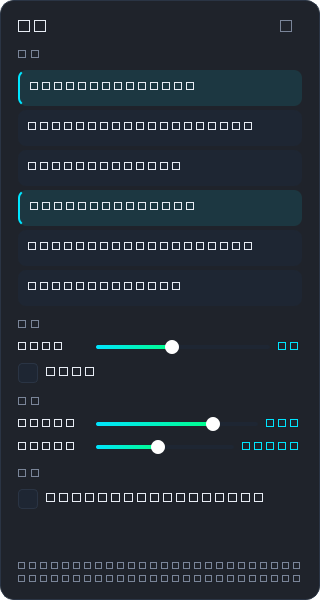
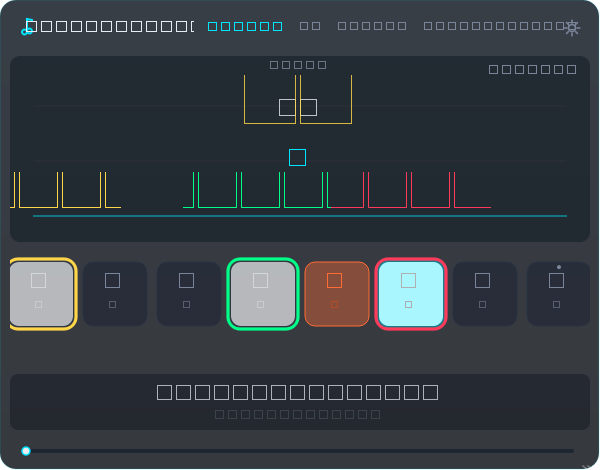
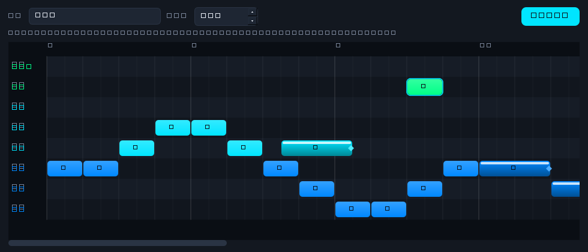
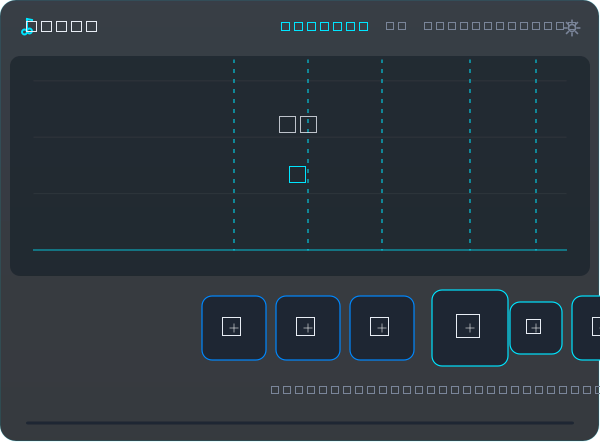
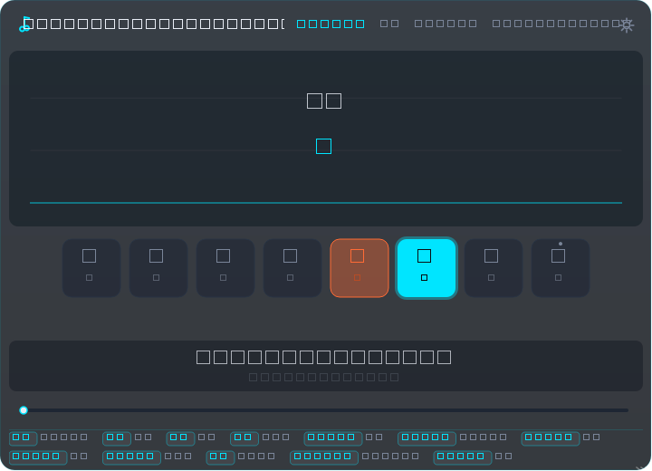

# ManboHakimi-Harp

三角洲行动口风琴**纯视觉**练习辅助浮窗。

> **v0.13 更名**：原名 **HarpGuide**，现更名为 **ManboHakimi-Harp**。EXE、窗口标题、托盘、文档、spec 与项目目录已全部同步，内部 Python 包名 `harpguide` 保持不变；旧 `%APPDATA%\HarpGuide` 数据会自动迁移。

- ❌ 不模拟任何键鼠输入
- ❌ 不读取游戏画面或内存
- ❌ 不注入游戏进程
- ❌ 不联网，数据完全本地存储
- ✅ 玩家跟随提示**手动**弹奏，工具只负责"告诉你怎么弹"
- ✅ 命中反馈仅被动读取 8 个演奏键按下状态，不拦截、不模拟按键

## ⚠️ 风险声明

游戏官方使用内核级反作弊系统（ACE），对第三方 Overlay 的合规边界未明确表态，
**存在被检测的可能性**。首次启动会弹出风险声明，须勾选确认后方可使用。
建议先在训练场测试；如官方明确禁止此类工具，请立即停止使用。

## 界面预览

| 主界面（含设置面板） | 命中反馈 |
|:--:|:--:|
|  |  |
| **乐谱编辑器** | **琴键校准** |
|  |  |
| **桌面悬浮球** | **底部热键提示条** |
|  |  |

## 安装（Windows）

```
1. 解压任意目录（如 D:\Tools\ManboHakimi-Harp）
2. 双击 ManboHakimi-Harp.exe
3. 阅读并勾选风险声明 → 进入主界面
```

单文件 EXE（约 46MB），**无需安装 Python 或任何运行时**。
首次运行会在 EXE 同级目录生成 `config/settings.json` 和 `scores/`（用户曲目存放处）。
**任务栏右下角会出现托盘图标**，左键切显隐、右键菜单管理（详见下方）。

## 键位映射（已按游戏实际界面确认）

| 键位列 | 1 | 2 | 3 | 4 | 5 | 6 | 7 | 8 |
|--------|---|---|---|---|---|---|---|---|
| 键盘键 | Z | X | C | V | B | N | M | , |
| 简谱   | 1 | 2 | 3 | 4 | 5 | 6 | 7 | 高音1 |

## 热键

| 热键 | 功能 |
|------|------|
| F1 | 开始 / 暂停提示 |
| F2 | 重置到 A 点（无 A-B 时回曲首） |
| F3 | 显示 / 隐藏浮窗 |
| F4 | 切换悬浮球 / 完整模式 |
| Ctrl+Shift+A | 把当前位置设为 A-B 循环的 **A 点** |
| Ctrl+Shift+B | 把当前位置设为 **B 点** 并开启循环；已开启时再按 = 清除并回到整曲 |
| Ctrl+Shift+T | 切换鼠标穿透 |
| Ctrl+Shift+C | 琴键校准模式（在校准中按则保存退出） |
| Ctrl+Shift+E | 乐谱编辑器（钢琴卷帘） |
| Ctrl+Shift+Q | 退出程序 |
| 小键盘 1 | 切「降调」档（半音阶口风琴 -1 半音） |
| 小键盘 2 | 切「半音/自然」档（回到自然音阶） |
| 小键盘 3 | 切「升调」档（半音阶口风琴 +1 半音） |
| 小键盘 0 | 开 / 关「自动变调」（跟随歌曲自动切调，免手动） |
| 小键盘 4 / 6 | 判定偏移 **-20 / +20ms**（补偿按早/按晚，命中反馈用） |
| 小键盘 5 | 判定偏移归零 |

> 若某个热键注册失败（被其他程序占用），**设置面板顶部会出现告警条**列出冲突的热键名，
> 在 `harpguide/hotkeys.py` 的 `HOTKEY_DEFS` 中改键后重新打包即可。

## 半音阶口风琴（v0.8 起）

游戏里的口风琴带「降调 / 半音 / 升调」三个推键（鼠标左/中/右键），本质是**半音阶口风琴**：
8 个物理键（Z X C V B N M ,）+ 推键切换半音，能吹出 12 个半音。

ManboHakimi-Harp 现已完整同步这套机制：

- 简谱支持半音记号 `#4`（升 4）、`b3`（降 3，等价 #2）
- 谱面遇到半音音符时，**琴键右上角 / 瀑布流音符上会画橙色 `#` 标记**，提示「这个键要切升调档再吹」
- 顶部信息条实时显示**当前调性档**，若与谱面需要不符会用橙色提示「→ 需升调↑」
- 小键盘 **1 / 2 / 3** 分别切换 降调 / 自然 / 升调 三档（对应游戏里的三个推键），默认自然档
- 按传统半音阶口风琴习惯，半音统一用「升调档」吹出，降号 `b` 自动等价转成升号
- **自动变调（v0.9）**：小键盘 0 或设置面板勾选开启后，调性档**自动跟随歌曲**切换，顶部信息条变绿显示「自动变调 · 升调↑」等，玩家只需专注按 8 个物理键，不用再手动切推键；手动按小键盘 1/2/3 会自动退出自动模式

## 命中反馈（v0.10，v0.12 判定手感修复）

类似《指上钢琴》的**判定 / 连击 / 得分**反馈：

- 开启命中反馈后，ManboHakimi-Harp 会在你按下 8 个演奏键（Z X C V B N M ,）时给出判定
  - `PERFECT`（±110ms，金色） / `GREAT`（±220ms，绿色） / `GOOD`（±350ms，青色） / `MISS`（红色）
- 判定文字从判定线位置向上弹出并淡出；命中的琴键会闪对应颜色的光环
- 连击数字会显示在瀑布流中央，10 连击以上变金色
- 右上角显示累计得分
- 空按（附近确实没有该键音符）或漏音都会显示红色 `MISS` 并重置连击
- 设置面板「显示」区可关闭

> 实现方式：仅被动轮询读取 8 个演奏键的按下状态，**不安装键盘钩子、不拦截、不模拟按键**，游戏仍正常收到按键。

### 判定手感修复（v0.12）

之前有不少「明明按对了还是 MISS」的情况，根因与修复：

| 问题 | 修复 |
|---|---|
| 判定窗口偏严（±300ms 就到顶） | 放宽为 **±110 / ±220 / ±350ms** |
| 一次失误被判**两个** MISS（按键空了记一次，音符滑过再记一次） | 新增 640ms「匹配窗口」：这一列附近有音符时，迟到/重复的按键**静默忽略**，不叠加 MISS |
| 玩家整体按早/按晚（人的反应 + 画面延迟） | 新增**判定偏移**，可把整个判定基准平移对齐 |
| 游戏满载时帧被拖慢，快速轻敲可能被漏读 | 轮询同时读取 `GetAsyncKeyState` 的按下标志位，**不漏掉帧间的轻敲** |
| 漏音定时器与判定窗口一样宽，会**抢先**把"还能判 GOOD"的音符判成 MISS | 漏音窗口 = 判定窗口 **+90ms 宽限**，任何能判 GOOD 的按键都保证先被吃掉 |
| 编辑器试听 / 切歌后换了一套音符，旧的"已判定"标记被套用 | `_judged` 改记**音符下标**（原先记 `id(note)`，会踩 CPython 地址复用），换曲时一并清空 |

**判定偏移怎么调（推荐做法）**：

1. 正常弹一段，看浮窗顶部的 `偏移 +XXXms`
   - `+` = 你整体按**晚**了；`-` = 整体按**早**了
2. 把设置面板「显示 → 判定偏移」调到这个数字（几轮就能收敛到 0）
   - 游戏中也能用小键盘调：**小键盘 4 / 6** 每次 -20 / +20ms，**小键盘 5** 归零
3. 顶部偏移读数变绿（|偏移| ≤ 110ms）就说明手感对齐了

## 底部热键提示条（v0.11）

浮窗最下方新增常驻**热键提示条**，把常用的全局热键以「键帽 + 说明」形式列出来，不用切到设置面板也能看到：

- 默认显示；可在设置面板「显示」区取消勾选「**底部热键提示条**」隐藏
- 宽度不够时自动换行，主窗口会自适应压缩瀑布流高度，保证提示条完整可见
- 不影响鼠标穿透 / 窗口拖动；纯展示，鼠标事件直接穿透

## A-B 段落循环（v0.6 核心）

反复练习同一段难点，不用每次从头再来。

- 播放到想循环的起点按 **Ctrl+Shift+A** → A 点设到当前位置（瀑布流顶部出现标记）
- 播放到终点按 **Ctrl+Shift+B** → B 点设到当前位置并开启循环（标记下方出现蓝色区间）
- 进度条上**可点击/拖动**任意位置直接跳转；A/B 手柄也跟着重画
- 再按一次 **Ctrl+Shift+B** 或在设置面板点「清除区间」→ 回到整曲（不再循环）
- **按曲目分别保存**：在 A 点-B 点内的进度，下次切回同一曲目会自动恢复
- 也可在设置面板直接输入拍数：填 A 拍 / B 拍 → 应用

切换曲目会自动清除当前 A-B 区间；预备拍期间（A 点位于起点前）按 A 点会自动吸附到 0ms。

## 歌词提示（v0.7）

随播放进度在琴键区上方显示当前歌词行（卡拉OK式）：

- 当前行居中高亮、下一行淡出预览，跟着曲子自动推进
- 18 首歌曲类内置曲目已配歌词；4 首练习曲/纯音乐（音阶、长按、跑动、天空之城）无歌词自动隐藏歌词区
- 设置面板「显示歌词提示」开关可随时关闭
- 歌词存于曲目 JSON 的 `lyrics` 数组（`{time, text}`），自定义曲目可手写，时间单位毫秒

## 可调整窗口大小（v0.7）

浮窗不再是固定尺寸，可自由拖动调整：

- **拖拽浮窗任意边缘或四角**即可改变宽高（光标自动切换）
- 右下角有斜线手柄提示可缩放
- 瀑布流区域随窗口高度**弹性伸缩**，琴键区高度固定
- 窗口宽度变化时，已校准的琴键几何**按比例缩放**，保持相对对齐
- 尺寸自动保存，下次启动恢复；设置面板「瀑布流高度」滑杆也可精确控制

> 鼠标穿透（Ctrl+Shift+T）开启时边缘拖拽失效（此时鼠标事件会穿透到游戏），关闭穿透即可调整。

## 琴键校准（v0.4）

不同分辨率/窗口模式下，游戏内键位的大小与间距会变化。校准模式可以把每个
琴键提示精确对齐到游戏键位上，瀑布流音轨会**自动跟随校准后的琴键中心**：

1. 按 **Ctrl+Shift+C** 进入校准（播放自动暂停、鼠标穿透自动关闭）
2. 拖动浮窗顶部信息条，把琴键区移到游戏键位附近
3. **拖动**单个琴键微调位置；**滚轮**缩放大小；**方向键** 1px 微调（Shift = 10px）
4. 瀑布流中的青色虚线实时指示每个琴键的中心，确认对齐后点 **保存并退出**

- 校准数据按**物理分辨率 @ 缩放比分档**保存到 `config/calibration.json`
  （同一块屏在 100% / 125% / 150% 缩放下分别独立保存）
- 浮窗被拖到另一块屏时**自动切换**到对应屏幕的校准档案
- 「恢复默认网格」可随时重置；「放弃修改」不保存任何改动
- 面板上的「整体放大 / 缩小」用于快速适配不同分辨率的键位尺寸

## 高 DPI / 屏幕适配（v0.6.2）

- 启动时自动把浮窗位置 clamp 到当前屏幕可用区域内；窗口过大时自动压缩瀑布流高度，避免被任务栏/屏幕下沿裁掉。
- 声明 per-monitor DPI awareness，系统缩放 125% / 150% 下浮窗像素与命中区保持准确。
- 校准档位按"物理分辨率 @ 缩放比"独立分档，换缩放/换显示器后旧校准不会被错位套用。

## 系统托盘（v0.6.1）

启动后**任务栏右下角会出现图标**：

- **左键单击** = 切换浮窗显示 / 隐藏
- **右键菜单**（Windows 习惯）：
  - 显示 / 隐藏浮窗
  - 设置面板…
  - 开始 / 暂停（带勾选状态）
  - 重置到开头
  - 琴键校准…
  - 乐谱编辑器…
  - **退出 ManboHakimi-Harp**

> 之前 EXE 只能通过 `Ctrl+Shift+Q` 退出，现在托盘右键菜单里直接有"退出"——更符合 Windows 习惯。
> 在没有系统托盘的环境（如 Linux 服务器）会自动关闭此功能，仅靠 Ctrl+Shift+Q + 浮窗操作。

## 长按音符提示体系（核心）

| 时机 | 瀑布流 | 琴键区 |
|------|--------|--------|
| 提前 2 拍 | 长条音符（高度随时值）自上而下 | 键位边框**呼吸闪烁**（预亮） |
| 到达判定线 | 头部白色亮条压线 | 键位实心高亮 + 旋转光环 |
| 长按中 | 长条持续外发光 | 键底绿色**剩余时间进度条**从满到空 |
| 剩余 <20% | 整条**渐变为橙色**，尾部菱形闪烁 | 键位变橙 + 进度条变橙闪烁 |
| 结束 | 音符消失 | 绿色淡入渐隐（已弹过） |

短按音符为固定高度方块，头部压线瞬间点击即可。

## 乐谱编辑器（v0.5，v0.6 强化）

按 **Ctrl+Shift+E** 打开钢琴卷帘式编辑器，不需要手写 JSON 也能做自己的曲子：

| 操作 | 效果 |
|------|------|
| 左键点空白格 | 新建 1 拍短按音符 |
| 按住空白向右拖 | 拉长时值；**超过 1 拍自动变长按** |
| 左键拖动音符 | 移动起始位置 |
| 按住音符右缘拖动 | 调整时值 |
| 右键点音符 | 删除 |
| Ctrl+Z / Ctrl+Y | 撤销 / 重做 |
| Ctrl+C / Ctrl+X / Ctrl+V | 复制 / 剪切 / 粘贴（粘贴按 0.5 拍网格落点） |
| Ctrl+A | 全部选中 |
| Del / Backspace | 删除选中 |

- 网格精度 0.5 拍（八分音符）；行 = 8 个琴键（顶部是高音 1）
- 顶部可改**曲名**与 **BPM**；打开时会载入当前曲目作为编辑底稿
- **保存并载入**：写入 `scores/<曲名>.json`，浮窗曲目列表自动刷新并切换到新曲目
- 用户曲目与内置曲目合并显示；同 id 时用户版本覆盖内置
- 试听按钮可把未保存的编辑内容直接载入浮窗播放，再按一次暂停

## 内置曲库（v0.8 共 26 首）

### 入门
- 小星星、玛丽有只小羊羔、两只老虎、生日快乐、铃儿响叮当、欢乐颂、友谊地久天长

### 进阶
- 天空之城（简化版）、练习·音阶上下行、练习·长按控制、练习·八分音符跑动、练习·连续长按衔接、练习·半音阶上下行

### 流行 / 动画（主旋律简化版·口风琴适配）
- 《父亲》《枫》《未闻花名》《奇迹再现》《猪猪侠》《别看我只是一只羊》
- 《孤勇者》《See You Again》《Butter-Fly》《蜜雪冰城甜蜜蜜》
- 《童话》《起风了》《海屿你》

> 这些流行曲目按 1-7 与高音1 这 8 个键做了简化（如原调复杂的周杰伦《枫》副歌只取核心乐句）。
> 简谱文件即源码 `gen_scores.py`，可在编辑器里按需微调后存为用户曲目。

## 设置面板（v0.6 补齐）

打开方式：浮窗顶部右上角齿轮按钮 / 默认位于浮窗右侧

| 分组 | 项目 |
|------|------|
| 曲目 | 26 首列表（点选切换）；右键菜单：**重命名**、**另存为副本**、**删除**（内置曲目只读） |
| A-B 循环 | 设 A 点 / 设 B 点并循环 / 直接填拍数 / 清除 |
| 演奏 | 变速滑杆（0.25x–2x）、整曲循环开关、**预备拍数**（0–8）、**长按预亮提前量** |
| 显示 | 不透明度、瀑布流高度、**下落时间**（毫秒）、拍线开关、**歌词开关**、长按流光开关、松开预警开关 |
| 鼠标穿透 | 全局穿透开关 |
| 热键冲突 | 启动时检测，被占用时面板顶部出现告警条列出冲突项 |

## 自定义乐谱（手写 JSON）

在 EXE 同级创建 `scores/` 文件夹，放入 JSON 乐谱即可（重启或切曲后生效）：

```json
{
  "version": "2.1",
  "id": "my_song",
  "name": "我的曲子",
  "bpm": 90,
  "keyMap": ["Z", "X", "C", "V", "B", "N", "M", ","],
  "notes": [
    { "key": "Z", "type": "tap",  "duration": 1.0, "beat": 0 },
    { "key": "X", "type": "hold", "duration": 2.0, "beat": 1 }
  ],
  "lyrics": [
    { "time": 0,     "text": "第一句歌词" },
    { "time": 2000,  "text": "第二句歌词" }
  ]
}
```

- `type`: `tap` 短按 / `hold` 长按 / `rest` 休止
- `duration`: 时值（拍）。0.25=十六分 0.5=八分 1=四分 2=二分
- `beat`: 起始拍数

也可以用简谱语法生成（开发模式运行 `gen_scores.py`）：
`3-` 长按 2 拍，`6--` 长按 3 拍，`0.5:3` 八分音符，`8` 高音 1，`0` 休止，`#4` 升 4、`b3` 降 3（半音，切升调档吹）。

## 从源码构建

```bash
# 需要 Python 3.13
pip install PySide6 PyInstaller
python main.py              # 开发模式运行
python main.py --selftest   # 离屏自检
build.bat                   # 打包为 dist\ManboHakimi-Harp.exe
```

## 目录结构

```
ManboHakimi-Harp/
├── main.py               入口（--selftest 离屏自检）
├── harpguide/
│   ├── models.py         乐谱/音符数据模型（tap/hold/rest）
│   ├── jianpu.py         简谱解析器（含长按语法）
│   ├── playback.py       播放引擎（仅驱动 UI，不模拟输入）
│   ├── waterfall.py      音符瀑布流渲染（长条/流光/橙色预警/列对齐）
│   ├── keys.py           琴键提示区（七态状态机 + 校准编辑交互）
│   ├── calibration.py    校准几何（按分辨率持久化）
│   ├── calibration_panel.py 校准工具面板
│   ├── editor.py         乐谱编辑器（钢琴卷帘）
│   ├── overlay.py        浮窗主窗口（透明置顶/点击穿透）
│   ├── floating_ball.py  悬浮球模式
│   ├── settings_panel.py 设置面板
│   ├── risk_dialog.py    风险声明
│   ├── hotkeys.py        全局热键
│   └── app.py            主控制器
├── scores/               26 首内置曲目（小星星/天空之城/孤勇者/童话/起风了 ...）
├── assets/icon.ico       EXE 图标
└── build.bat             一键打包
```
